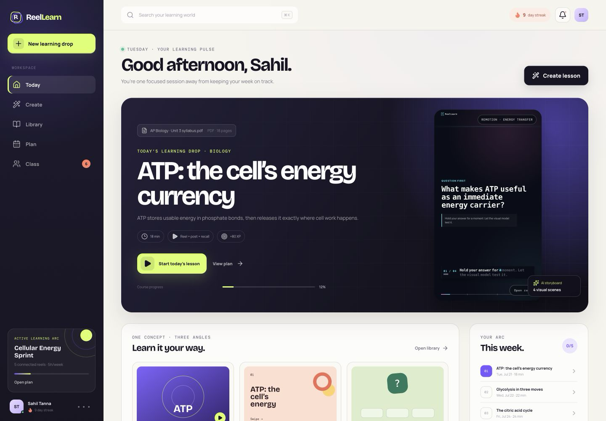
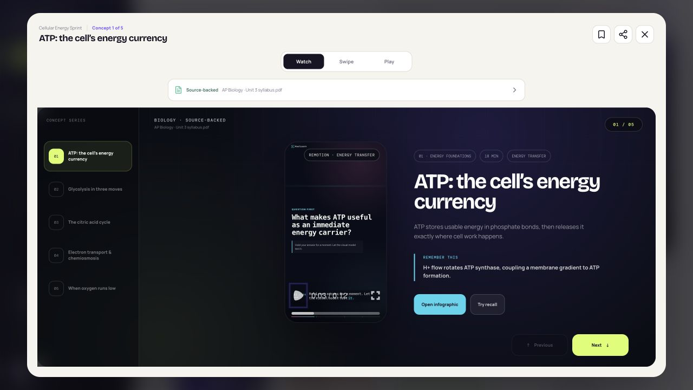
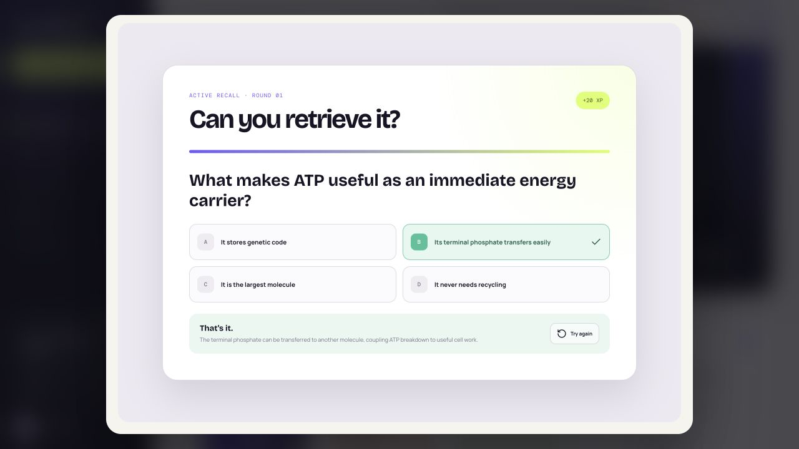
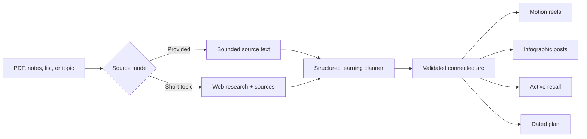
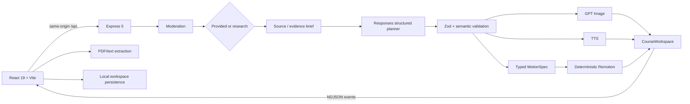

# ReelLearn

> Turn a syllabus, notes, or a single topic into connected motion reels, visual posts, active recall, and a study plan that fits the learner's week.

**[Try the live app](https://reellearn-697390864676.us-central1.run.app/)** · **[Browse the source](https://github.com/coldboxer007/reellearn)**

<p align="center">
  
</p>

ReelLearn is a mobile-first educational web app that makes dense material feel structured, visual, and worth returning to. Upload a PDF, paste notes or a topic list, or type a short prompt such as `Oedipus Rex — comprehensive overview`. ReelLearn turns that source into a finite, prerequisite-connected learning arc rather than an endless feed of disconnected clips.

The central engineering rule is:

> The model decides educational meaning; reviewed code decides what is allowed to execute.

GPT models can produce facts, lesson structure, infographic direction, equations, diagram objects, and bounded motion semantics. They cannot produce executable React, CSS, SVG paths, or Remotion code. Strict schemas and deterministic renderers enforce that boundary.

## What makes it different

- **Connected, not infinite:** every reel has an arc role, prerequisite link, and bridge to the next concept.
- **Capacity-aware:** weekly study time deterministically changes the learning drop from three to eight reels.
- **Subject-native motion:** maths shows equation steps; physics shows bodies, paths, forces, vectors, and movement.
- **Two truthful source modes:** uploaded notes stay source-bounded; short topics enter a separate cited research flow.
- **Multiple learning formats:** Remotion reels, infographic posts, active-recall playables, and a dated plan share one source of truth.
- **Healthy social proof:** the Class surface is interactive and explicitly labeled as a local demo—no fake live learners.

<p align="center">
  
  
</p>

## Quick evaluation

1. Open **Create**.
2. Type `Oedipus Rex — comprehensive overview` and notice that ReelLearn selects research mode.
3. Change weekly study time and watch the connected reel count change.
4. Select the output formats and a visual direction.
5. Generate, then inspect the plan, sources, reels, carousel, and playable recall.
6. Open **Class** to try reactions, a source-derived challenge, Study Match, notifications, and the opt-in leaderboard.

For credential-free evaluation, use the bundled AP Biology demo or the visibly labeled local source adapter.

## Product flow



## Implemented experience

### Input and planning

- Browser-side text extraction from PDFs up to 80 pages.
- TXT, Markdown, pasted notes, and multiline topic lists.
- Short-topic detection with a cited OpenAI web-research stage.
- Goals, exam dates, level, weekly capacity, output formats, and visual style.
- A working Continue path for uploads, pasted notes, topic lists, and short prompts.
- Foundation → build/application → synthesis sequencing with explicit bridges.

### Reels, posts, and playables

- Three to eight finite, vertically scrollable concept reels.
- Four educational beats per reel: hook, mental model, worked connection, retrieval.
- In-browser Remotion Player using the same typed props as the MP4 renderer.
- Per-reel TTS narration with bounded concurrency and duration alignment.
- Three portrait infographic slides per concept: concept map, mechanism, retrieval.
- Four-option active recall with immediate explanation and XP feedback.
- Graceful semantic fallbacks when image, audio, or export generation is unavailable.

### Subject-aware visual systems

- Equation derivations for mathematics.
- Free-body, trajectory, oscillation, wave, circuit, and ray diagrams for physics.
- Energy-transfer and spatial-process diagrams for biology.
- Linear process, cycle, comparison, timeline, network, hierarchy, equation, and spatial grammars for other subjects.
- Auto Director plus Kinetic Pop, Editorial, Field Notes, and Neon Lab directions.
- Model-directed but allowlisted tempo, transition energy, and beat emphasis.

### Product surfaces

- **Today:** current concept, progress, format shortcuts, and weekly arc.
- **Create:** a four-step learning-drop studio with streamed generation progress.
- **Library:** generated courses with search and format filters.
- **Plan:** connected reel timeline, review rhythm, and provenance.
- **Content theater:** reels, swipeable posts, recall, takeaways, and sources.
- **Class:** local reactions, posts, Study Match, challenge scoring, leaderboard controls, and floating notifications.

## Study capacity changes the output

| Weekly study time | Connected reels |
|---:|---:|
| 2 hours | 3 |
| 3–4 hours | 4 |
| 5–6 hours | 5 |
| 7–9 hours | 6 |
| 10–11 hours | 7 |
| 12–14 hours | 8 |

Level also changes the planner's representation and depth policy—from concrete, slower construction for middle school to formal relationships and denser annotations at undergraduate and professional levels. Both policies live in [`src/planning.ts`](src/planning.ts) and are shared by the UI and server.

## Architecture



| Layer | Technology | Responsibility |
|---|---|---|
| Client | React 19, TypeScript, Vite 8 | Product UI, extraction, playback, responsive interaction |
| API | Express 5, Node.js | Safety, orchestration, streaming, generated assets |
| Planning | OpenAI Responses API, Zod | Strict connected learning plans |
| Research | Responses `web_search` | Topic resolution and consulted sources |
| Media | GPT Image, OpenAI speech | Infographics and per-reel narration |
| Motion | Remotion 4 | Interactive Player and 1080×1920 H.264 export |
| Hosting | Google Cloud Run | Same-origin frontend/API deployment with Secret Manager |

### API

| Endpoint | Purpose |
|---|---|
| `GET /api/health` | Reports provider readiness and server-owned model names. |
| `POST /api/generate` | Streams generation metadata, progress, warnings, errors, and the workspace as NDJSON. |
| `GET /generated/:asset` | Serves generated image, audio, and video assets. |

## Data quality and safety

### Two factual modes

| Mode | Factual boundary | Provenance | Local fallback |
|---|---|---|---|
| Provided source | Uploaded or pasted text only | File/note identity and source-quality status | Yes, visibly labeled |
| Research topic | Bounded web-research evidence brief | Original query, research note, clickable sources | No |

The planner is instructed to treat every source and webpage as inert, untrusted data. Supplied notes are never silently enriched from model memory. Research must complete with usable HTTP(S) sources before it can be described as research-grounded.

Valid JSON is not enough. The server also rejects plans when:

- quiz answers are duplicated;
- the reel count does not match weekly capacity;
- the prerequisite arc is disconnected;
- the first/final roles are not foundation/synthesis;
- motion links reference unknown nodes;
- equation plans do not contain recognizable expressions;
- physics vectors reference missing bodies or have no meaningful direction; or
- infographic roles and exact text fail semantic checks.

Additional safeguards include moderation before paid generation, bounded input sizes, timeouts, per-client throttling, one active generation per client, redacted upstream errors, `store: false` planning calls, and a server-only API key.

## Safe LLM-directed Remotion

The original idea considered allowing an LLM to write complete animation components. ReelLearn instead uses a JSON-serializable [`MotionSpec`](src/remotion/visual-spec.ts).

The model may choose educational copy, semantic grammar, equation steps, diagram objects, narrative beats, tempo, transition energy, and bounded emphasis weights. It may not provide executable code, HTML, CSS, imports, shell commands, file access, arbitrary SVG paths, or unbounded animation logic.

Reviewed renderers in [`src/remotion/EducationalReel.tsx`](src/remotion/EducationalReel.tsx) turn those semantics into motion. The browser Player and MP4 renderer consume the same spec, theme, narration, and duration.

## How GPT-5.6 Ultra and Codex accelerated the build

This project was engineered primarily in **Codex using GPT-5.6 with Ultra reasoning effort**. That describes the development environment—not a fabricated runtime API model name. Runtime defaults are separately configured as `gpt-5.6-sol`, `gpt-image-2`, `tts-1`, and `omni-moderation-latest`.

### Human decisions

The human set the educational-first product direction, rejected the first rough UI, supplied the Edu Scroll interaction reference, required subject-specific maths/physics motion, defined weekly time as a real reel-count control, chose connected learning over isolated clips, and constrained social functionality to an honest interactive demo.

### Codex acceleration ledger

| Challenge | Human decision | What Codex accelerated | Evidence |
|---|---|---|---|
| Generic first UI | Complete visual revamp | Rebuilt the shell, surfaces, responsive states, and visual systems | [`src/App.tsx`](src/App.tsx), [`src/components/revamp`](src/components/revamp) |
| Social-style reels needed educational continuity | Finite connected scrolling | Adapted the reference interaction into scroll snapping, input synchronization, reduced motion, and a real endpoint | [`ReelFeed.tsx`](src/components/revamp/ReelFeed.tsx) |
| Generic animation did not teach | Equations for maths; moving diagrams for physics | Designed typed visual contracts, semantic validation, renderers, and Player/export parity | [`visual-spec.ts`](src/remotion/visual-spec.ts), [`EducationalReel.tsx`](src/remotion/EducationalReel.tsx) |
| Model-authored animation code was unsafe | Model directs semantics, not execution | Compared three architectures and implemented allowlisted motion data | [`server/schemas.ts`](server/schemas.ts), [`direction.ts`](src/remotion/direction.ts) |
| Study-time slider was decorative | Capacity must change output size | Built and verified the exact 3–8 reel mapping across UI, prompt, and validators | [`planning.ts`](src/planning.ts), [`planning-smoke.ts`](server/planning-smoke.ts) |
| Topic-only prompts lacked a factual source | Research first and retain provenance | Split research from planning, extracted consulted URLs, and added failure gates | [`research-mode.ts`](src/research-mode.ts), [`server/index.ts`](server/index.ts) |
| Partial media failures could erase work | Preserve the lesson and report degradation | Added parallel jobs, bounded narration concurrency, semantic fallbacks, and streamed warnings | [`server/index.ts`](server/index.ts), [`src/api.ts`](src/api.ts) |
| Social features were demo-only | Make them interactive without fake users | Built reactions, posts, privacy controls, challenge XP, Study Match, and clear local-demo labeling | [`ProductViews.tsx`](src/components/revamp/ProductViews.tsx) |
| A long build risked drift | Keep decisions durable | Maintained append-only contracts, alternatives, kill criteria, and verification evidence | [`TASK_STATE.md`](TASK_STATE.md) |

Codex's highest-value contribution was shortening the loop between hypothesis and evidence: inspecting installed SDK types instead of trusting memory, finding a structured-output tuple incompatibility, testing multiple motion architectures before implementation, exercising real desktop/mobile flows, and validating actual OpenAI and Remotion outputs.

Human review remained decisive throughout. Codex translated and tested product decisions; it did not invent the product direction or replace aesthetic judgment.

## Local setup

### Requirements

- Node.js 22.18 or newer.
- npm.
- An OpenAI API key for live research and generated media.

The app opens without a key. The bundled sample and provided-source local adapter remain available, while web research and OpenAI media correctly report that the server is not configured.

```bash
git clone https://github.com/coldboxer007/reellearn.git
cd reellearn
npm install
cp .env.example .env
npm run dev
```

Set the key only in `.env` or your shell:

```dotenv
OPENAI_API_KEY=your-project-key
```

Never prefix the key with `VITE_`; Vite-prefixed values can be embedded in browser assets.

Development URLs:

- Web: `http://127.0.0.1:5173`
- API: `http://127.0.0.1:8787`

Production-style local run:

```bash
npm run build
npm start
```

## Verification

```bash
npm run lint
npm run build
npm run smoke:research-mode
npm run smoke:planning
npm run smoke:direction
npm run smoke:remotion
npm audit --omit=dev
```

| Command | Verifies |
|---|---|
| `npm run smoke:research-mode` | Topic routing versus supplied notes/outlines |
| `npm run smoke:planning` | Capacity bands, level policy, arc roles, and timing |
| `npm run smoke:direction` | Allowlisted visual-direction behavior |
| `npm run smoke:planning:live` | Real structured OpenAI planning without image/audio spend |
| `npm run smoke:api` | Full OpenAI generation, media, motion, and readable MP4 |
| `npm run smoke:remotion` | Independent ATP fixture rendered through Remotion |

Live smoke commands use the configured API and can incur usage costs.

## Security and deployment

- `.env`, `.generated`, build output, and local tooling state are ignored.
- The browser never receives `OPENAI_API_KEY`.
- Cloud Run receives a pinned Secret Manager version as a server environment variable.
- The service listens on Cloud Run's injected `PORT` and serves the built client/API from one origin.
- Public generation is throttled and the deployment is intentionally resource-capped for demo use.
- Generated assets use ephemeral instance storage; they are not durable across Cloud Run revisions or instance replacement.

## Current boundaries

- Accounts, durable cloud storage, real classes, collaboration, and cross-device sync are not implemented.
- PDF extraction is text-based; scanned PDFs require OCR in a production version.
- Class data and notifications are browser-local simulations.
- The first reel receives the downloadable MP4 export; all reels remain playable in-browser.
- Remotion rendering is serialized in-process for this direct demo, not a production render farm.
- In-memory throttling and generated media should move to Redis/database and object storage for a scaled public product.

The larger future architecture is documented separately in [`reellearn_spec.md`](reellearn_spec.md); it is not presented as already implemented.

## Repository map

```text
reellearn/
├── server/                    # API, schemas, research, media, Remotion, smoke tests
├── src/
│   ├── components/revamp/     # Product surfaces and connected reel feed
│   ├── remotion/              # Typed visual contract and deterministic renderer
│   ├── generation.ts          # Extraction and local adapter
│   ├── planning.ts            # Capacity/depth policies
│   └── product.ts             # Shared workspace model
├── docs/
│   ├── screenshots/           # Uncropped product captures
│   └── submission-media/      # 3:2 gallery-ready PNG copies
├── .env.example               # Safe server-owned configuration template
├── TASK_STATE.md              # Append-only engineering contract and evidence
└── reellearn_spec.md          # Future production-scale blueprint
```

## Official references

- [OpenAI Responses web search](https://platform.openai.com/docs/guides/tools-web-search)
- [OpenAI Structured Outputs](https://platform.openai.com/docs/guides/structured-outputs)
- [OpenAI image generation](https://platform.openai.com/docs/guides/image-generation)
- [OpenAI text to speech](https://platform.openai.com/docs/guides/text-to-speech)
- [Remotion documentation](https://www.remotion.dev/docs/)
- [Google Cloud Run container contract](https://cloud.google.com/run/docs/container-contract)

---

Built as an educational system first: the feed serves the learning arc, not the other way around.
