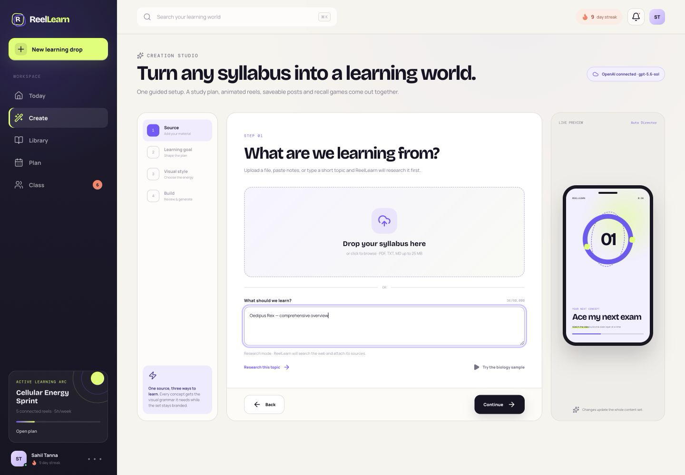
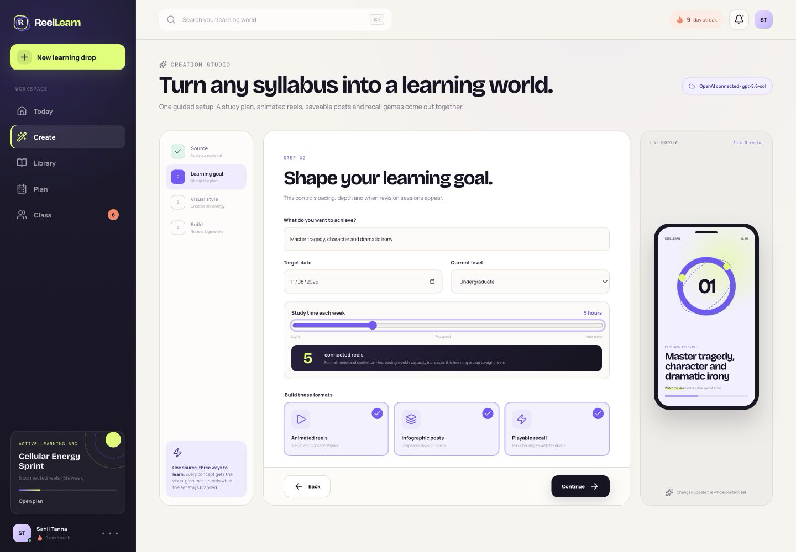
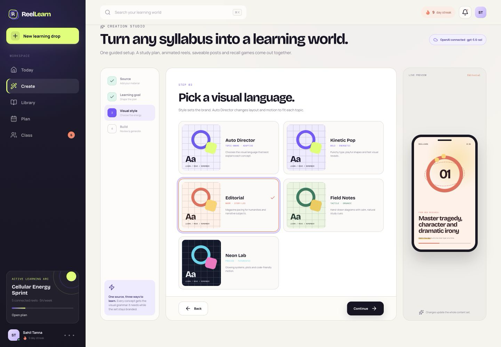
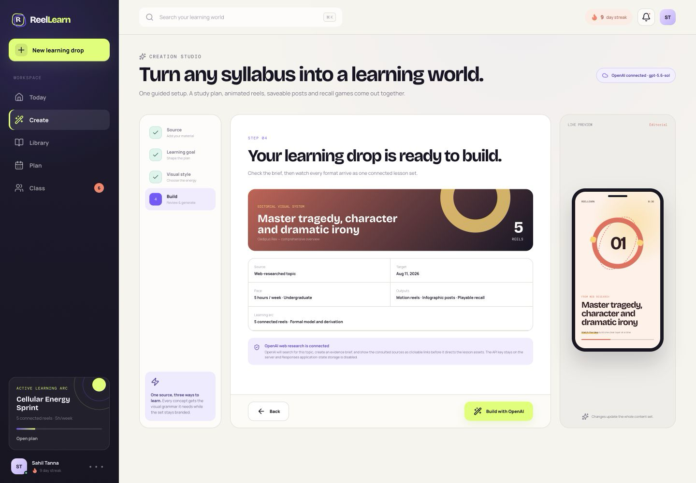
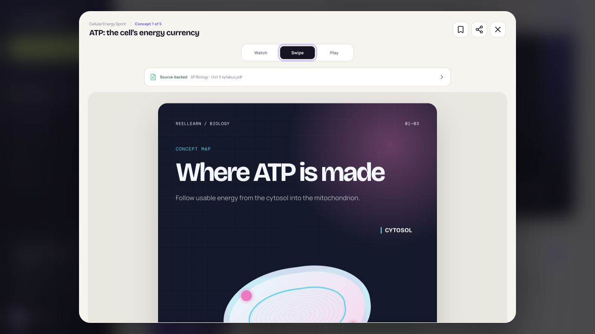
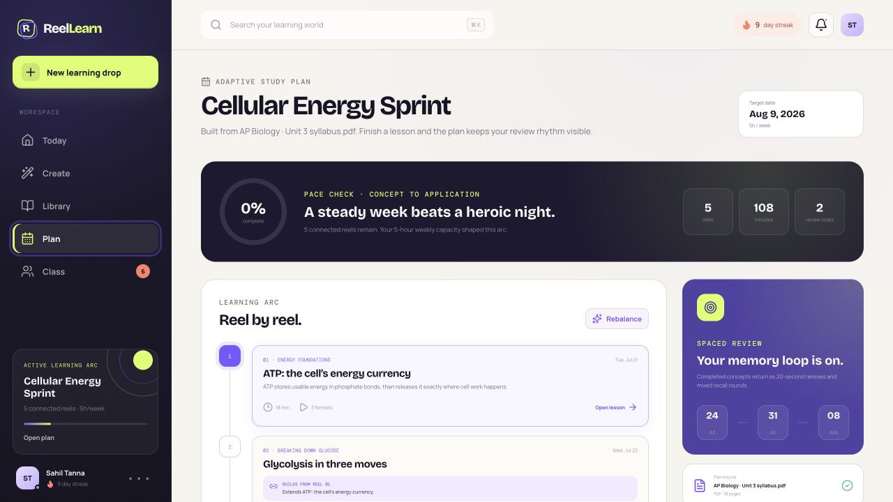
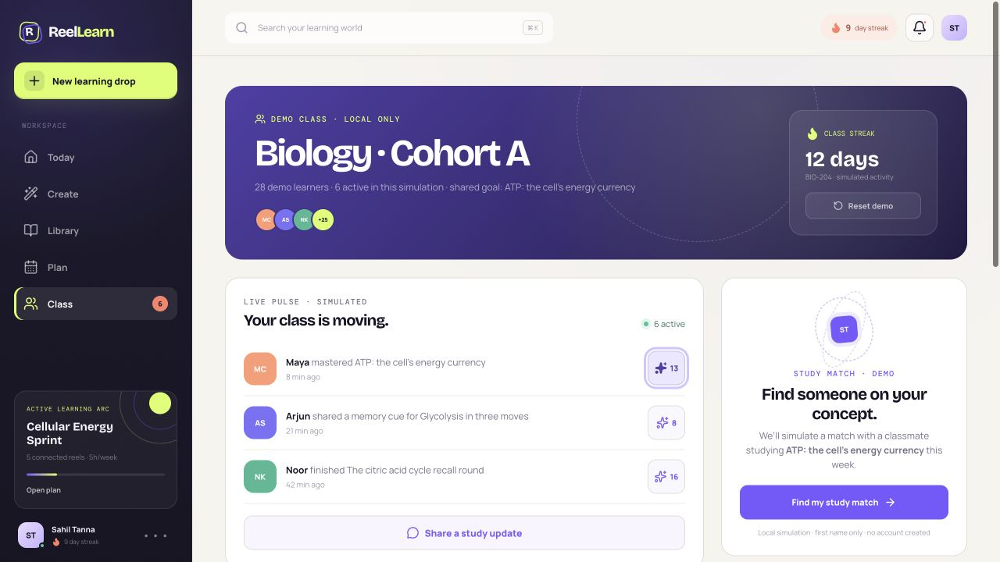
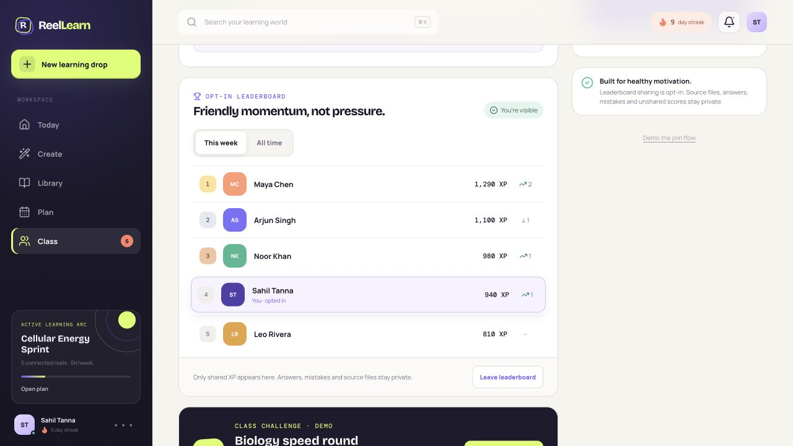
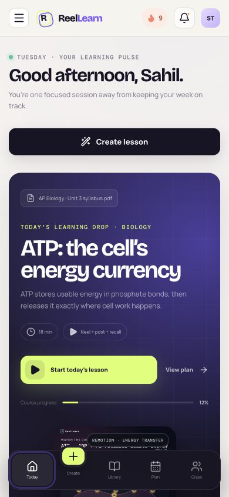

# ReelLearn screenshot library

Curated on 22 July 2026 from the running web app. These unannotated source captures are retained for the project submission, README, pitch deck, and demo notes. Each image was taken from an intentional product state and checked for loading failures, browser errors, and awkward transient UI.

## Preview gallery

### 01 — Learning world

### 02 — Researched topic

### 03 — Capacity-sized arc

### 04 — Visual style director

### 05 — OpenAI research review

### 06 — Connected Remotion reel

### 07 — Infographic carousel

### 08 — Active recall

### 09 — Connected plan

### 10 — Class and Study Match

### 11 — Leaderboard and challenge

### 12 — Mobile dashboard

## Capture dimensions

- Detailed desktop workspace captures: 1440×1000 (`01`–`05`).
- Presentation-format product captures: 1280×720 (`06`–`11`).
- Mobile responsive capture: 390×844 (`12`).

The PNG files are unannotated source captures. Add external submission labels or crops only to copies so these originals remain reusable.
